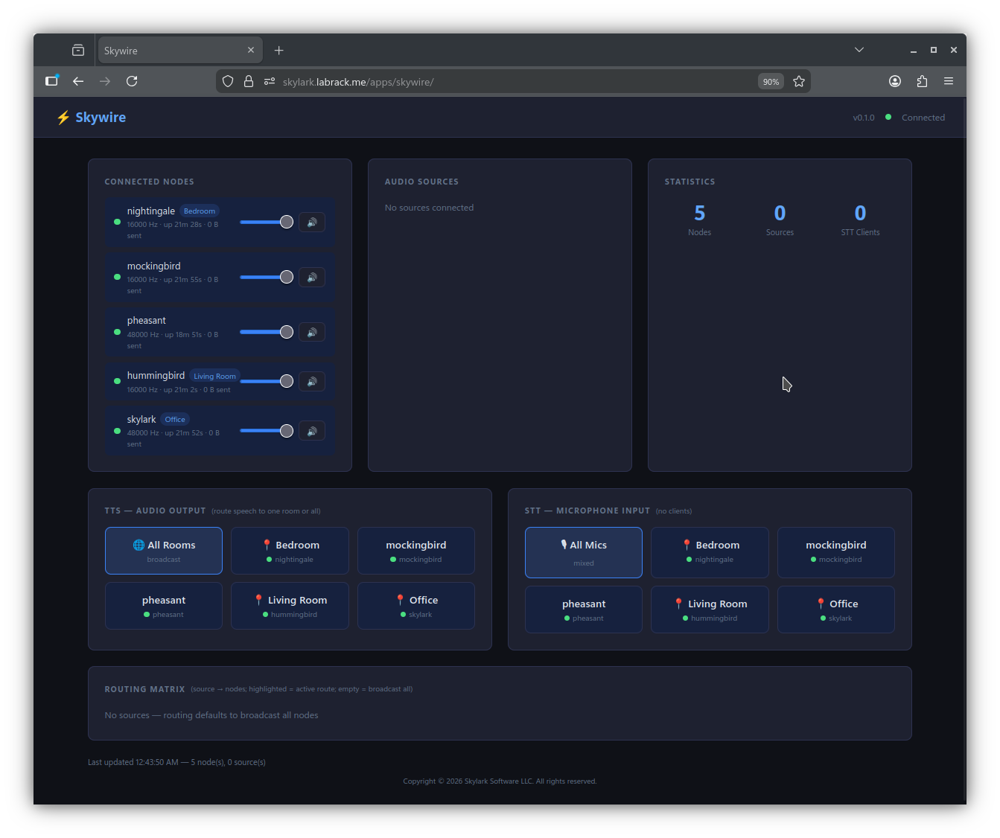
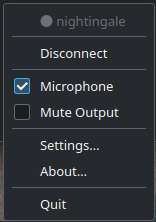
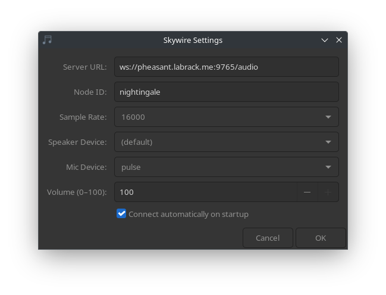

<p align="center">
  
</p>

# Skywire

Distributed multi-room audio routing. A software AV receiver that connects speaker nodes across a network, routes audio sources to any combination of rooms, and captures microphone audio for speech recognition.



Copyright (c) 2026 Skylark Software LLC. All rights reserved.

---

## What it does

- **Routes audio to any room** — TTS, music, system audio, or any WebSocket source can be directed to one room, a group of rooms, or broadcast everywhere
- **Per-room volume and mute** — each node has independent volume and mute control from the dashboard or tray
- **TTS switching** — one-click to direct speech to a specific room, or broadcast to all
- **STT microphone routing** — select which node's microphone feeds your speech-to-text service
- **Web dashboard** — visual routing matrix, live node status, and audio source monitoring
- **System tray** — desktop nodes show connection status, mic toggle, and mute in the taskbar
- **AI control via MCP** — Claude and other MCP-compatible models can control routing, volume, and STT source

---

## Architecture

```
Audio Sources                Skywire Server              Speaker Nodes
─────────────                ──────────────              ─────────────
TTS engine  ──────────────►  routing matrix  ◄────────►  Living Room 🔊🎤
Music/MPD   ──────────────►  web dashboard   ◄────────►  Kitchen     🔊🎤
System audio ─────────────►  REST API        ◄────────►  Bedroom     🔊🎤
                             MCP server      ◄────────►  Office      🔊🎤
STT engine  ◄─────────────   (mic audio)
```

The server runs centrally (Docker or standalone). Nodes are lightweight processes running on any machine with speakers — desktop machines use the tray app, headless machines use the node service.

---

## Quick Start

### 1. Run the server

**Docker (recommended):**

```bash
git clone https://github.com/Skylark-Software/Skywire.git
cd Skywire
docker compose up -d
```

**Or standalone:**

```bash
chmod +x bin/skywire-server
./bin/skywire-server
```

The dashboard is available at `http://your-server:3030`.

### 2. Connect a node

On each machine with speakers:

```bash
chmod +x bin/skywire-node
./bin/skywire-node --server ws://your-server:3030/audio --node-id kitchen
```

Or install as a service (see [Deployment](#deployment) below).

### 3. Desktop tray app

For desktop machines with a taskbar:

```bash
chmod +x bin/skywire-tray
./bin/skywire-tray
```

Configure the server URL in the settings dialog (right-click the tray icon).

---

## Components

### Server (`skywire-server`)

Central routing engine. Handles all WebSocket connections, the audio routing matrix, and serves the web dashboard.

- Dashboard: `http://your-server:3030`
- Audio WebSocket: `ws://your-server:3030/audio`
- Source WebSocket: `ws://your-server:3030/source`
- STT WebSocket: `ws://your-server:3030/stt`

### System Tray App (`skywire-tray`)

For desktop machines. Sits in the taskbar showing connection state — click to connect/disconnect, toggle mute, toggle microphone, or open settings.

| | |
|---|---|
|  |  |
| Right-click menu | Settings dialog |

- Blue icon = connected
- Gray icon = disconnected
- Red icon = error
- Mic checkbox enables microphone capture for STT

### Headless Node (`skywire-node`)

For always-on endpoints (servers, Raspberry Pi, etc.). Runs as a systemd user service with auto-reconnect.

```bash
./bin/skywire-node --server ws://your-server:3030/audio --node-id kitchen
```

### MCP Server (`skywire-mcp`)

Exposes audio routing controls to AI models via the Model Context Protocol.

```json
{
  "mcpServers": {
    "skywire": {
      "command": "./bin/skywire-mcp",
      "args": ["--skywire-url", "http://your-server:3030"]
    }
  }
}
```

Available tools: `list_nodes`, `list_sources`, `get/set_routing`, `set_volume`, `set_mute`, `get/set_stt_source`, `get_status`.

---

## Requirements

### System Tray App (Linux)

```bash
# Debian/Ubuntu
sudo apt install libxdo3 libasound2 libgtk-3-0

# Fedora
sudo dnf install libxdo alsa-lib gtk3
```

### Headless Node (Linux)

```bash
# Debian/Ubuntu
sudo apt install libasound2

# Fedora
sudo dnf install alsa-lib
```

### Server

No additional dependencies when running via Docker. Standalone requires only glibc 2.35+.

---

## Platform Compatibility

### Linux Distribution Support

Pre-built binaries require **glibc 2.35+**:

| Distribution | Version | Status |
|--------------|---------|--------|
| Ubuntu | 22.04+ | ✅ Supported |
| Debian | 12 (Bookworm)+ | ✅ Supported |
| Fedora | 36+ | ✅ Supported |
| RHEL / Rocky / Alma | 9+ | ✅ Supported |
| Arch Linux | Rolling | ✅ Supported |

### Architecture

- **x86_64 (amd64)**: Pre-built binaries provided
- **aarch64 (arm64)**: Build from source required (Raspberry Pi 4/5)

### Audio Backend

Skywire uses **ALSA** directly on Linux:

- **PulseAudio** systems: Works via ALSA compatibility layer
- **PipeWire** systems: Works via ALSA compatibility layer
- **Headless servers**: Requires ALSA with a dummy or loopback device

---

## Node Configuration

Each node reads `~/.config/skywire/node.json`:

```json
{
  "server": "ws://your-server:3030/audio",
  "node_id": "kitchen",
  "location": "Kitchen",
  "sample_rate": 16000,
  "volume": 100,
  "muted": false,
  "mic_enabled": true,
  "mic_device": "pulse",
  "auto_connect": true
}
```

| Field | Description |
|-------|-------------|
| `server` | Skywire server WebSocket URL |
| `node_id` | Unique identifier shown in dashboard |
| `location` | Human-readable room label |
| `sample_rate` | Audio sample rate (16000 recommended for STT) |
| `mic_enabled` | Capture and stream microphone audio |
| `mic_device` | Mic device name (`pulse`, `default`, or specific device) |
| `auto_connect` | Connect automatically on startup |

---

## Deployment

### Docker

```bash
docker compose up -d
```

The server runs on port 3030 with host networking.

### Reverse Proxy (Caddy)

```
handle_path /apps/skywire* {
    reverse_proxy localhost:3030
}
```

When behind a reverse proxy, nodes connect via:
```
ws://your-domain/apps/skywire/audio
```

### Node as a systemd service

```ini
[Unit]
Description=Skywire Audio Node
After=network-online.target sound.target

[Service]
ExecStart=/usr/local/bin/skywire-node
Restart=always
RestartSec=5
WatchdogSec=60

[Install]
WantedBy=default.target
```

```bash
# Install binary
sudo cp bin/skywire-node /usr/local/bin/
# Enable service
systemctl --user enable --now skywire-node
```

### Tray app autostart (KDE/GNOME)

`~/.config/autostart/skywire-tray.desktop`:

```ini
[Desktop Entry]
Type=Application
Name=Skywire Tray
Exec=/usr/local/bin/skywire-tray
X-KDE-AutostartEnabled=true
```

---

## Audio Sources (TTS/STT Integration)

Sources connect via WebSocket to `/source` and send raw PCM or base64-wrapped JSON:

```json
{ "type": "audio", "data": "<base64-pcm>", "targets": ["kitchen", "bedroom"] }
```

STT engines connect to `/stt` and receive raw PCM from whichever nodes are selected as the active microphone source in the dashboard.

---

## License

Copyright (c) 2026 Skylark Software LLC. All rights reserved.

This software is the proprietary property of Skylark Software LLC. Unauthorized copying, distribution, or modification is strictly prohibited. See [LICENSE](LICENSE).

---

<p align="center">
  
</p>
